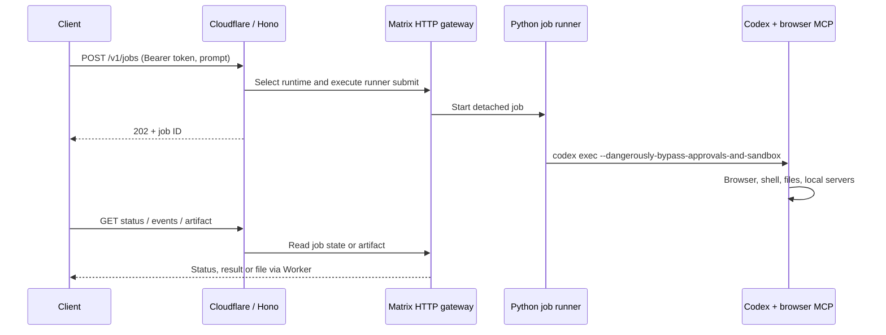

# Aloud Matrix API

A Hono API deployed as a Cloudflare Worker. It accepts natural-language tasks and runs Codex on your Matrix cloud computer with **YOLO mode**, automatic MCP approvals, browser access, shell access and persistent files. The iPhone app is not connected yet.



## Try the deployed API

Base URL: `https://aloud-matrix-api.max-766.workers.dev`

The API token is in the ignored `backend/.secrets.json` (`API_TOKEN`) and `.dev.vars`. It is also configured as a Cloudflare secret. The example client reads it without printing it:

```sh
cd ~/projects/aloud/backend
export ALOUD_API_URL=https://aloud-matrix-api.max-766.workers.dev
node --input-type=module <<'JS'
import { client } from './scripts/client.mjs';
const api = await client();
const response = await api('/v1/jobs', {
  method: 'POST',
  headers: { 'Idempotency-Key': 'my-first-research-001' },
  body: JSON.stringify({
    prompt: 'Use the browser to visit example.com and follow Learn more. Save a short summary and screenshot in artifacts/.',
    timeoutSeconds: 180
  })
});
console.log(await response.json());
JS
```

Poll `/v1/jobs/<id>` with the same client to get the result. Change the idempotency key for each new task. Repeat the same key and body to retry a dispatch; reusing it with different input returns `409`.

For a complete browser/files/network test:

```sh
npm run smoke -- "$ALOUD_API_URL"
```

This test creates a CSV, computes its sum, creates and serves a local website, clicks a button using browser MCP, navigates a public website, and downloads proof and screenshots into ignored `.smoke/`. It also verifies authentication, idempotency and cancellation.

## HTTP interface

Every `/v1/` endpoint requires `Authorization: Bearer <API_TOKEN>`. `GET /health` is public and only checks Worker availability.

| Method | Path | Purpose |
| --- | --- | --- |
| GET | `/v1/computer` | Check Matrix runner connectivity and configured mode |
| POST | `/v1/jobs` | Submit `{prompt, timeoutSeconds?}`; returns 202 and Location |
| GET | `/v1/jobs/:id` | State, final response and artifact list |
| POST | `/v1/jobs/:id/cancel` | Cancel queued job or request termination of active job |
| GET | `/v1/jobs/:id/events?cursor=0` | Read progress metadata and next byte cursor |
| GET | `/v1/jobs/:id/artifact?path=proof.json` | Download a file from the job's artifacts directory |

Statuses: `queued`, `running`, `succeeded`, `failed`, `timed_out`, `cancelled`. Cancellation of an active job is asynchronous: poll until terminal. A successful process exit means Codex completed its turn; applications must still inspect its answer and validate task-specific outcomes.

Prompts: 1–20,000 characters. Timeout: 10–600 seconds (default 180), starting when execution begins. One job runs at a time on the shared computer. Artifact downloads are limited to 700,000 bytes per file to fit Matrix's 1 MiB terminal response limit; larger files remain on Matrix. Results return at most 100,000 characters and up to 100 artifact entries. Progress exposes tool/status metadata; full Codex JSONL and stderr stay on Matrix.

If submission returns a gateway error, the response includes `jobId` and `statusUrl`: the detached job may already exist. Poll or retry with the **same** idempotency key. No key means each request creates a new job.

## Setup and redeploy

Prerequisites: Node 22+, Python 3.11+, authenticated Matrix CLI cloud profile, and a Cloudflare account. On Matrix, Codex must be installed and logged in and the browser MCP configured. The installation script only installs this project's job runner; it preserves your Codex login and MCP configuration.

```sh
npm ci
npm run configure          # reads ~/.matrixos/profiles/cloud/auth.json
npm run install:matrix     # uploads Python runner, checks its health
npx wrangler login
npm run deploy
npx wrangler secret bulk .secrets.json
```

`npm run configure` creates local ignored credentials with mode 0600, preserving the existing API token. It does not print secrets. Use `MATRIX_PROFILE` to select another local profile. Worker runtime origins, slot and runner path are in `wrangler.jsonc`; the installer defaults to the same primary Matrix computer and path.

Matrix principal tokens expire. The initial deployment's token expires **2026-10-04 11:28 UTC**. After renewing Matrix CLI authentication, run `npm run configure` and `npx wrangler secret bulk .secrets.json` again. This example does **not** refresh credentials automatically; expired/revoked access returns `503 matrix_auth_required`. Codex uses the existing ChatGPT login on Matrix and its account limits.

For local Worker development, run `npm run dev`. It still executes jobs on the real Matrix computer.

## Remote execution

Runner: `/home/matrix/home/projects/aloud-research/api/runner.py`

Job data: `api/jobs/job_<id>/` beneath the same project. Each directory contains `request.json`, `status.json`, `events.jsonl`, `stderr.log`, `result.txt` and `work/artifacts/`. Jobs persist after HTTP disconnection. If the supervisor disappears, polling marks the job failed; jobs are not automatically restarted after a VM reboot. There is no automatic retention cleanup yet.

Codex starts with `--dangerously-bypass-approvals-and-sandbox`, uses the computer's configured default model, and automatically approves tools on enabled MCP servers for that invocation. Existing per-tool approval overrides are also set to approve. Browser output is redirected to the current job's artifacts directory. These per-run overrides do not rewrite global Codex settings. Existing enabled/disabled tool selections remain in effect.

This is a single-owner hackathon API. A valid API token grants agent execution with the Matrix user's full permissions, including its existing passwordless sudo. Jobs share the computer and are not isolated from one another. Keep the token in trusted server-side clients. Cancellation terminates Codex and its process group; it cannot undo completed actions or guarantee removal of deliberately detached descendants. Chromium's own browser sandbox remains enabled; that is separate from the disabled Codex execution sandbox.

The adapter uses the gateway endpoints used by Matrix CLI 0.3.21: computer inventory, runtime selection, terminal execution and file upload. These may change with Matrix releases. The hosted Matrix MCP endpoint is not required.

## Validation

```sh
npm run typecheck
npm test
npm run test:runner
npx wrangler deploy --dry-run
```

TypeScript tests cover authentication, validation, safe dispatch arguments, token exchange, idempotency IDs, transport errors and artifact paths. Python tests exercise detached execution, persistent results, idempotency conflicts, running/queued cancellation, deadlines, artifacts, sanitized events and unattended MCP settings. The deployed smoke test exercises the real Worker, Matrix gateway, Codex and browser.

Verified on **2026-10-03** against the deployed Worker: job
`job_a308338f0e7e390a9c29b20b78d64b10` completed in 103.7 seconds without approvals.
It wrote and read a CSV (sum 17), created a local website, clicked its button,
followed example.com's link to IANA and downloaded both browser screenshots.
The downloaded CSV and PNG files were independently checked. Unauthenticated
requests were rejected, repeated submissions returned the same job, and a queued
job was cancelled. All six API tests and four runner tests also passed.
